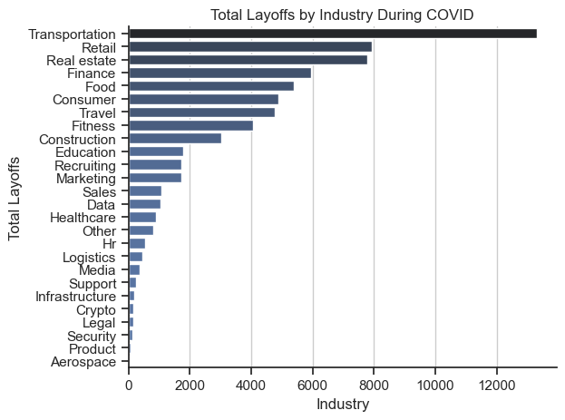
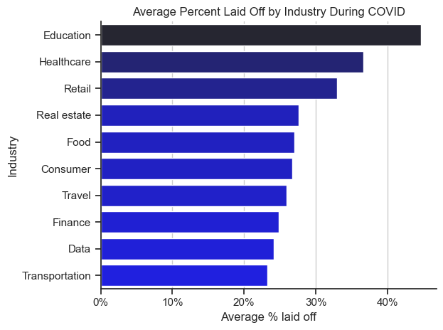
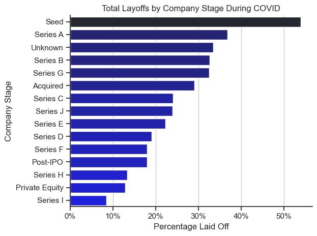
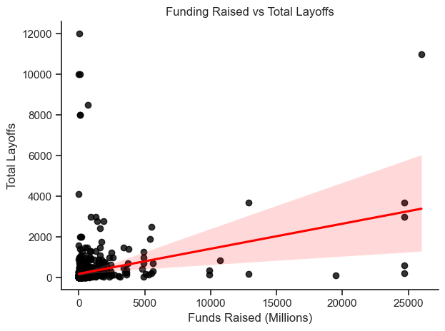
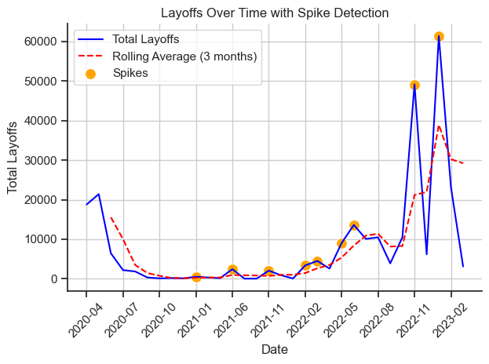
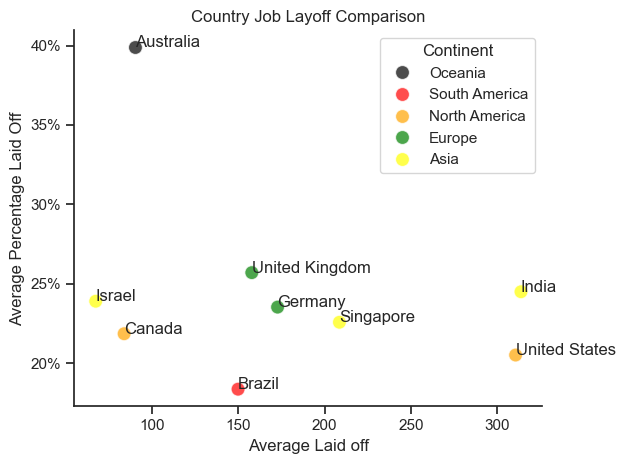

# Overview

Welcome to my analysis of the global job market, with a particular focus on worldwide layoffs. This project was inspired by the goal of understanding trends in layoffs across industries, regions, and company stages. It aims to provide insights into workforce dynamics and identify patterns that may help professionals and organizations navigate economic challenges. The majority of layoff data used in this project is dated between April 2020 - April 2022, times where workforces were largely affected by the COVID-19 pandemic, and therefore can provide insights of how companies, industries and countries were affected by this.

The dataset, sourced from [Alex The Analyst's Worldwide Layoffs Data](https://github.com/AlexTheAnalyst/MySQL-YouTube-Series/blob/main/layoffs.csv), which I have explored and cleaned using SQL to produce [my own dataset](https://huggingface.co/datasets/Jamiefor3/Worldwide_Layoffs_Data) used in the python analysis. It includes detailed information on industries, company stages, percentages laid off, funding, and locations. Using a series of SQL queries and Python scripts, this project explores critical questions such as the industries most affected, layoff trends over time, and how different countries are affected by layoffs.

# The Questions
Below are the questions I wanted to answer in this project:

1. How were different industries layoffs affected by COVID?
2. How were different company stages layoffs affected by COVID?
3. What is the relationship between funds raised and total layoffs?
4. How did the total worldwide layoffs change over time?
5. How do different countries compare with each other?

# Tools I Used
For my analysis of worldwide layoffs, I made use of several key tools:

- **SQL:** Used for exploratory data analysis as well as cleaning the data for use in python.
- **Python:** The backbone of the analysis allowing me to find key insights through the use of scripts. Within python I frequently used the following libraries: Pandas, Matplotlib and Seaborn.
- **Jupyter Notebooks:** The tool used to run my python scripts, allowing easy inclusion of notes and analysis.
- **Visual Studio Code:** Also used for executing python scrips
- **Git and Github:** Used for version control and sharing my project.

# Data Preparation and Cleanup
### To prepare my data for analysis I used SQL. There were 5 main stages of the cleanup.

My queries and notes can be read here:
[Layoff_Project_Cleaning.sql](Layoff_Project_Cleaning.sql)

1. **Standardising the date format** ensures consistency and enables accurate sorting, filtering, and analysis of time-based data.

2. **Removing duplicate entries** eliminates redundancy and prevents skewed results in analysis.

3. **Handling NULL or missing values** avoids errors and ensures the dataset is complete and reliable.

4. **Standardising text data** facilitates accurate grouping, comparisons, and analysis of categorical fields.

5. **Verifying data integrity** ensures the dataset is accurate, trustworthy, and aligns with expected standards.


### In Python I prepared for analysis by:

#### Importing Libraries
```
import numpy as np
import pandas as pd
from datasets import load_dataset
import matplotlib.pyplot as plt
from matplotlib.ticker import PercentFormatter
import ast
import seaborn as sns
from adjustText import adjust_text
```
#### Loading Data and Modifying Date Column
```
dataset = load_dataset('Jamiefor3/Worldwide_Layoffs_Data')
df = dataset['train'].to_pandas()

df['date'] = pd.to_datetime(df['date'])
df_dates = df[df['date'] < '2022-05-01']
```
This code will load the data and then convert the 'date' column into a date time format allowing for easier date-related operations like sorting, filtering by date range, or performing calculations. As well as create a new dataframe with only data from the main COVID timeline (March 2020 - April 2022).

# The Analysis

Code and notes for all the questions, analysis and visualisations can be found here:
[Layoff_Analysis.ipynb](Layoff_Analysis/Layoff_Analysis.ipynb)

## 1. How were different industries layoffs affected by COVID?
Examining how layoffs in different industries were affected by COVID-19 is vital for understanding the pandemic's economic impact. COVID-19 triggered widespread disruptions, with some industries experiencing significant workforce reductions due to reduced demand, supply chain challenges, or shifts in consumer behavior.

To analyze this, I created two visualizations. The first calculates the total layoffs by industry during the pandemic, highlighting which sectors experienced the highest overall job losses. The second focuses on the average percentage of layoffs by industry, offering insights into the relative workforce impact within each sector. Together, these visualizations provide a comprehensive view of the pandemic's impact on industry employment, uncovering both absolute and proportional trends in layoffs.

### Visualisation code
---
```
sns.set_theme(style='ticks')
sns.barplot(data=industry_layoffs, y='industry', x='total_laid_off', hue='total_laid_off', palette='dark:b_r', legend=False)
sns.despine()
plt.title('Total Layoffs by Industry During COVID')
plt.xlabel('Industry')
plt.ylabel('Total Layoffs')
plt.tight_layout()
plt.grid(True, axis='x')
plt.tight_layout()
plt.show()
```
```
sns.barplot(data=industry_perc_plot, x='percentage_laid_off', y='industry', hue='percentage_laid_off', palette='dark:blue_r', legend=False)
sns.despine()
plt.title('Average Percent Laid Off by Industry During COVID')
plt.ylabel('Industry')
plt.xlabel('Average % laid off')
plt.grid(True, axis='x')
ax = plt.gca()
ax.xaxis.set_major_formatter(PercentFormatter(decimals=0))
plt.tight_layout()
plt.show()
```

### Results
---




### Insights
---
#### **Total Layoffs by Industry During COVID**
- **Transportation Industry:** This industry experienced the highest total layoffs, which is consistent with the significant impact of travel restrictions and reduced demand for transportation services during COVID. Airlines, ride-sharing services, and logistics companies were particularly affected.

- **Retail and Real Estate:** These industries rank high in total layoffs. Retail faced challenges with store closures and the shift to e-commerce, while real estate was impacted by reduced mobility and uncertainty in housing and commercial spaces.

- **Finance and Food Industries:** Both saw notable layoffs. Finance may have been affected by market volatility and reduced economic activity, while the food industry faced disruptions in supply chains and reduced demand for dine-in services.
Lower Layoffs: Aerospace, security, and legal industries saw fewer layoffs, likely due to their specialized nature and continued demand in certain sectors during the pandemic.

#### **Average Percent Laid Off by Industry During COVID**
- **Education Sector:** This sector had the highest average percentage of layoffs, reflecting the challenges in adapting to remote education and budget cuts during the pandemic.

- **Healthcare Sector:** Surprisingly high average layoffs were observed, possibly due to layoffs in administrative roles or non-essential healthcare services that were halted during the pandemic.
Retail and Real Estate: Both had significant average layoffs, further emphasizing their struggles with lockdowns and reduced physical operations.

- **Transportation:** While it had the highest total layoffs, the average percentage of layoffs was lower compared to education and healthcare, potentially because the industry employs a larger workforce overall.

#### **Combined Insights**
- **High Total vs. High Percentage Layoffs:** Transportation had the most significant total layoffs, while education faced the highest average layoffs percentage. This indicates that while transportation saw widespread layoffs across a large workforce, education had a more concentrated impact within its workforce.

- **COVID's Broad Impact:** Industries heavily reliant on in-person interaction (e.g., transportation, retail, food) and those disrupted by remote transitions (e.g., education) were among the hardest hit.

- **Key Focus Areas:** Support for industries like transportation, education, and retail could mitigate future economic shocks of similar nature.


## 2. How were different company stages layoffs affected by COVID?
Understanding how layoffs impact companies at different stages is essential for identifying trends in workforce stability across the business lifecycle. Startups, growth-stage companies, and mature enterprises often face unique challenges that influence their layoff patterns, such as funding constraints, market pressures, or restructuring efforts.

To explore this, I conducted an analysis by grouping companies based on their stage and calculating the average percentage of layoffs for each group. I then visualized these averages using a bar plot, highlighting the relative layoff rates across stages. This approach helps reveal which company stages are most affected by layoffs, providing valuable insights into the relationship between business maturity and workforce reductions.

### Visualisation code
---
```
sns.barplot(y='stage', x='percentage_laid_off', data=stage_layoffs, hue ='percentage_laid_off', palette='dark:blue_r', legend=False)
sns.despine()
plt.title('Total Layoffs by Company Stage During COVID')
plt.xlabel('Percentage Laid Off')
plt.ylabel('Company Stage')
plt.grid(True, axis='x')
ax = plt.gca()
ax.xaxis.set_major_formatter(PercentFormatter(decimals=0))
plt.tight_layout()
plt.show()
```

### Results
---


### Insights
---
- **Seed and Early-Stage Companies:** Startups in their early stages (e.g., Seed, Series A, B) were especially vulnerable during the pandemic, as many struggled with funding, pivoting to remote operations, and navigating an uncertain market. This contributed to higher layoffs at these stages.

- **Impact of Acquisitions:** Acquired companies may have faced layoffs as the acquiring firms streamlined operations to adapt to the pandemic’s economic effects.

- **Series C to E Companies:** Many companies in these stages were moderately stable but still faced pressure to reduce costs or downsize as a result of pandemic-related market disruptions.

- **Later Stages and Subsidiaries:** More established companies and subsidiaries typically had stronger financial cushions or access to funding, enabling them to avoid the drastic layoffs seen in earlier-stage companies.

- **Unknown:** I decided to keep the companies with an unknown stage in the data set to almost act as a random sampling of stages. This group having a high percentage could show that the majority of companies affected had harsh layoff amounts.

#### **Key Insights**
- **Early-Stage Vulnerability:** Startups in seed and Series A stages were most affected, highlighting the fragile nature of businesses reliant on investor confidence during economic downturns.

- **Resilience of Later Stages:** More established companies had the resources to maintain operations, reflecting their greater ability to adapt and survive through crises.

- **COVID's Broad Impact:** The pandemic exposed structural weaknesses in early-stage startups, reinforcing the importance of financial planning and crisis preparedness for companies at all stages.

## 3. What is the relationship between funds raised and total layoffs?

Understanding the relationship between funds raised and total layoffs is crucial for assessing how financial resources influence workforce stability. Companies that have raised significant funds might be expected to sustain their workforce better, but layoffs could still occur due to mismanagement, market downturns, or overexpansion.

To explore this relationship, I conducted an analysis using a scatter plot with a regression line. First, I filtered out extreme outliers in the dataset (companies raising over $120 billion) to ensure the results were not skewed. Then, I plotted the relationship between funds raised and total layoffs, highlighting trends with a regression line to reveal potential correlations. This visualization provides insights into whether companies with higher funding experience proportionally more or fewer layoffs, shedding light on the broader dynamics of financial resources and workforce decisions.

### Visualisation code
---
```
sns.regplot(x='funds_raised_millions', y='total_laid_off', data=funds_no_outliers, scatter_kws={'color': 'black'}, line_kws={'color': 'red'})
ax = plt.gca()
ax.xaxis.set_major_formatter(plt.FuncFormatter(lambda x, pos: f'£{int(x/1000)}b'))
sns.despine()
plt.title('Funding Raised vs Total Layoffs')
plt.xlabel('Funds Raised (Millions)')
plt.ylabel('Total Layoffs')
plt.tight_layout()
plt.show()
```

### Results
---


### Insights
---
- **Positive Correlation:** The plot shows a weak but noticeable positive correlation between the funds raised (in millions) and the total layoffs. Companies with higher funding are more likely to have larger layoffs.

- **High Layoffs in Low-Funded Companies:** Many companies with funding below 5 billion still show significant layoffs, likely representing smaller businesses struggling to survive with limited resources during COVID.

- **Outliers in High Funding:** A few companies with very high funding (e.g., above 20 billion) also laid off large numbers of employees. These could be large, well-funded firms restructuring to reduce costs during the pandemic.

- **Confidence Band:** The red shaded region around the regression line suggests variability in the relationship. Layoffs are not strictly proportional to funding raised but are influenced by other factors like industry, company size, or stage.

#### **Key Insights:**
- **Larger Companies Lay Off More:** Well-funded companies generally have larger workforces, leading to higher layoffs during restructuring or economic downturns.

- **Startup Struggles:** Small companies with limited funding still contribute significantly to layoffs, reflecting their financial vulnerabilities.

- **COVID's Broad Impact:** Layoffs occurred across all funding levels, showing that both small startups and large corporations faced challenges during the pandemic.

## 4. How did the total worldwide layoffs change over time?

Understanding how total worldwide layoffs changed over time provides valuable insights into broader economic trends and external shocks, such as global crises or market shifts. By analyzing the temporal patterns of layoffs, we can identify periods of heightened job losses and explore potential causes behind these spikes.

To examine this, I grouped the data by month to calculate the total layoffs per month and plotted these figures alongside a 3-month rolling average to smooth out short-term fluctuations. Additionally, I identified and highlighted months where layoffs significantly exceeded the rolling average (spikes), providing a clear view of abnormal periods of job losses. This analysis captures both the overall trajectory of layoffs over time and key moments of heightened activity, offering a deeper understanding of global layoff dynamics.

### Visualisation code
---
```
sns.lineplot(x=df_month['date'].astype(str), y=df_month['total_laid_off'], label='Total Layoffs', color='blue')
sns.lineplot(x=df_month['date'].astype(str), y=df_month['rolling_avg'], label='Rolling Average (3 months)', color='red', linestyle='--')
spikes = df_month[df_month['total_laid_off'] > df_month['rolling_avg'] * 1.5]
sns.scatterplot(x=spikes['date'].astype(str), y=spikes['total_laid_off'], color='orange', label='Spikes', s=100)
sns.despine()
plt.title('Layoffs Over Time with Spike Detection')
plt.xlabel('Date')
plt.ylabel('Total Layoffs')
ticks = df_month.index[::3]
tick_labels = df_month['date'].iloc[::3]
plt.xticks(ticks, tick_labels, rotation=45)
plt.legend()
plt.grid(True)
plt.tight_layout()
plt.show()
```

### Results
---


### Insights
---
- **Initial Spike (2020 Q2):** A sharp rise in layoffs occurred around April 2020, coinciding with the onset of COVID-19 lockdowns. Businesses responded quickly to economic uncertainty, leading to widespread layoffs.

- **Low Activity (2020 Q3–2021 Q4):** Layoffs declined significantly after mid-2020 and remained relatively low throughout 2021, reflecting partial economic recovery and government stimulus measures.

- **Resurgence (2022):** Layoffs began to rise again in early 2022, possibly due to inflation concerns, tightening economic policies, and reduced consumer demand.

- **Major Spikes (2022 Q4–2023 Q1):** Two prominent spikes are visible in late 2022 and early 2023. These align with the global economic slowdown, tech industry corrections, and layoffs in overstaffed sectors following pandemic hiring booms. Some big names all contributed to such large spikes during this time, such as Google, Meta, Amazon, Microsoft, Twitter and PayPal.


#### **Key Insights:**
- **COVID Onset Impact:** Layoffs peaked early in the pandemic as businesses adjusted to sudden economic constraints.

- **Economic Corrections:** Post-pandemic overhiring and economic challenges contributed to late-2022 and early-2023 spikes.

- **Gradual Increases:** A steady rise in layoffs after 2021 suggests a mix of macroeconomic factors, such as inflation, supply chain issues, and global market uncertainties.


## 5. How do different countries compare with each other?

To understand how layoffs differ across countries, it's important to explore global variations in both the total number of layoffs and the percentage of employees laid off. This comparison can shed light on regional trends, such as which countries were more heavily impacted by layoffs and whether certain regions experienced more severe workforce reductions.

For this analysis, I filtered countries with more than 10 data entries to ensure reliable comparisons. I then grouped the data by country and calculated the mean total layoffs and average percentage of layoffs. To enhance the visualization, I mapped each country to its respective continent and used color coding to distinguish regions. The result is a scatter plot that compares total layoffs against the percentage laid off for each country, with annotations to provide clear identification. This visualization offers a comprehensive look at how different countries are affected by layoffs, both in terms of scale and workforce proportion.

### Visualisation code
---
```
sns.scatterplot(data=country_totals, x='total_laid_off', y='percentage_laid_off', s= 100, hue='Continent', palette=continent_colors, alpha= 0.7 )
for i, txt in enumerate(country_totals.index):plt.annotate(txt, (country_totals['total_laid_off'].iloc[i], country_totals['percentage_laid_off'].iloc[i]))
sns.despine()
plt.title('Country Job Layoff Comparison')
plt.xlabel('Average Laid off')
plt.ylabel('Average Percentage Laid Off')
ax = plt.gca()
ax.yaxis.set_major_formatter(PercentFormatter(decimals=0))
plt.tight_layout()
plt.show()
```

### Results
---


### Insights
---
- **Australia:** The highest average percentage of layoffs, though the average number of layoffs is relatively low. This suggests smaller companies with significant workforce reductions in response to economic pressures.

- **United States:** High average layoffs with a lower percentage. This aligns with the United States large economy and workforce, where layoffs often reflect large-scale organizational adjustments.

- **India:** Similar to the U.S, with high average layoffs and a 25% average layoff rate. This suggests significant impacts on large companies.

- **Brazil:** 150 average layoffs with the lowest percentage laid off. Economic challenges during COVID likely contributed to these numbers.

- **European Countries (UK and Germany):** Both of these countries had similar layoff averages and percentages. These countries experienced balanced impacts across industries during economic downturns.

- **Canada and Israel:** The Lowest average layoff and percentages. These reflect smaller but steady economic disruptions during COVID.

- **Singapore:** Slightly higher average layoffs but lower percentage, indicative of large organizations in sectors like retail and finance being affected.

#### **Key Insights:**
- **Regional Variation:** Countries with smaller economies (e.g., Australia, Brazil) saw higher layoff percentages, while larger economies (e.g., U.S., India) experienced higher average layoffs but lower percentages.

- **Industry Influence:** Tech-heavy countries (e.g., United States, India, Singapore) likely drove higher layoff averages due to corrections in overhiring during the pandemic.

- **Economic Scale:** Larger workforces distribute layoffs over a broader base, resulting in lower percentage impacts for economies like the U.S. and India.

- **Australia's Outlier Status:** Its unique combination of high layoff percentages and low averages may reflect targeted reductions in specific, smaller sectors.

# What I learned
This was my first solo project where I put everything together myself, it was also my first time using SQL for a project, therefore I learned a lot of new knowledge and skills during this time. 

- **SQL:** Using SQL for both some exploratory data analysis and data cleaning widened my scope of what I can do with the programme, as well as how I can export my new data from SQL. 
- **Job Market Impact:** While analysing the data I was able to better understand just how easily workforces can be affected by affected by conditions that are out of our control.


# Insights
This project uncovered some key insights about recent worldwide layoffs:

- **Industry-Specific Layoffs:** The high percentage of layoffs in Education and Healthcare highlights how even critical industries were not immune to disruptions during COVID, emphasizing structural weaknesses and shifting priorities (e.g., remote learning, telemedicine). Meanwhile, total layoffs in Transportation and Retail underline the devastating effects on industries heavily reliant on in-person activities, showcasing the economic ripple effects of lockdowns.

- **Company Stage Vulnerability:** The stark layoffs in early-stage companies reflect the fragility of startups during economic downturns. These companies rely on external funding to survive, and with investors tightening budgets during the pandemic, many had no choice but to reduce staff. This underscores the high-risk nature of entrepreneurship and the challenges in sustaining growth during global crises.

- **Funding vs. Layoffs:** The disconnect between high funding levels and significant layoffs illustrates that money alone doesn’t ensure stability. Many of these companies likely overexpanded during the pandemic boom (e.g., in tech sectors) and had to adjust to slower-than-expected growth. This highlights the importance of sustainable growth strategies over aggressive scaling.

- **Country-Specific Patterns:** Higher layoffs in tech-heavy economies like the U.S. and India demonstrate how overhiring during the pandemic created unsustainable workforces, leading to significant corrections. In contrast, countries with smaller, more specialized economies (e.g., Australia and Brazil) saw layoffs driven by local demand changes, illustrating how the pandemic’s impact varied widely based on economic structure and industry focus.

# Challenges With This Project
This project was not without its set backs, which forced me to be adaptable with my analysis.

- **Data Inconsistency:** The data that I had to work with was only around half the size of the original dataset, which had a lot of missing values which would have disrupted my analysis.

- **Data Visualisation:** This project contained some basic bar plots which I was confident creating, but I challenged myself to push myself with some visualisations like the layoffs over time and country comparison graphs. I was able to create these in the way I wanted, but it was something that I had to research and teach myself on.

# Conclusion
The layoff trends during COVID-19 revealed critical vulnerabilities across industries, company stages, and countries, highlighting the wide-ranging impact of the pandemic on the global workforce. Industries like Education, Healthcare, and Transportation faced significant challenges, reflecting both structural weaknesses and shifts in demand caused by lockdowns and remote work adoption. Startups and early-stage companies were particularly fragile, with their reliance on external funding making them highly susceptible to economic uncertainty.

The data also underscores the importance of sustainable growth strategies, as many well-funded companies struggled to maintain stability, leading to large-scale layoffs. Furthermore, the geographic differences in layoff patterns emphasize how the economic structure and reliance on specific industries shaped the pandemic’s impact in different regions.

Ultimately, this project demonstrates the interconnectedness of global industries and economies, offering valuable lessons on resilience and adaptability for businesses and policymakers navigating future crises. By analyzing these trends, stakeholders can better prepare for potential disruptions and build more sustainable, equitable employment strategies moving forward.